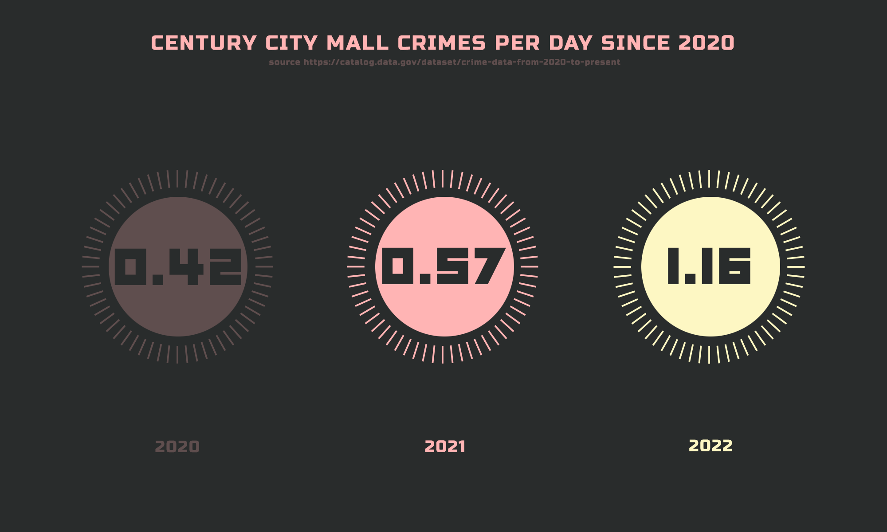
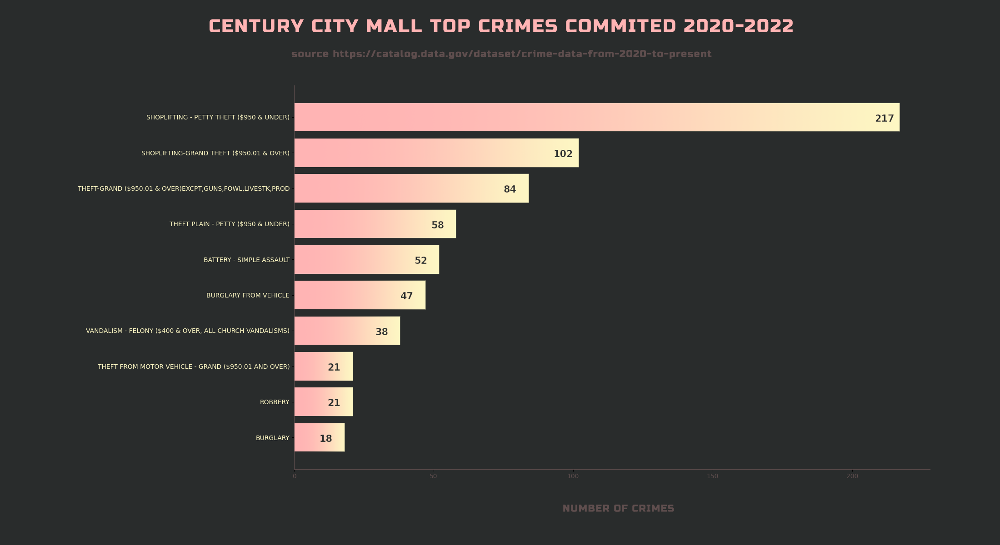
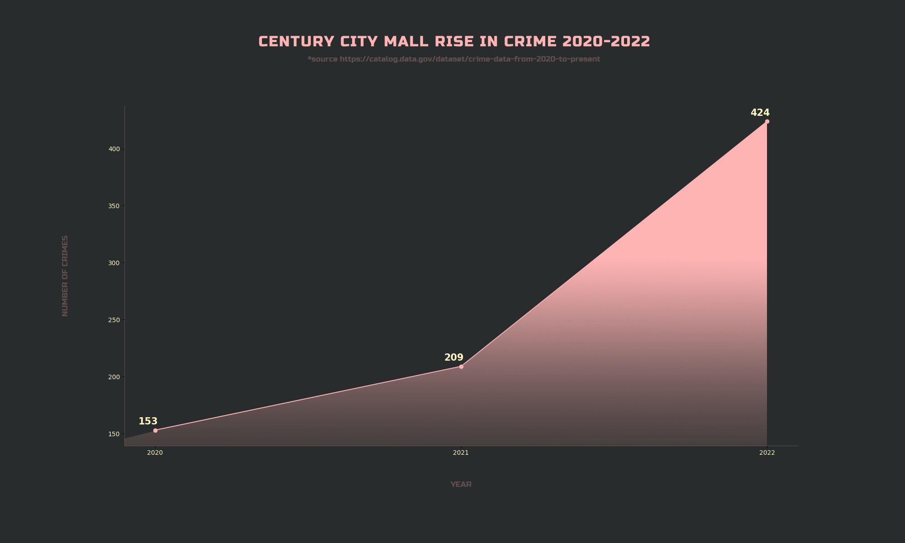
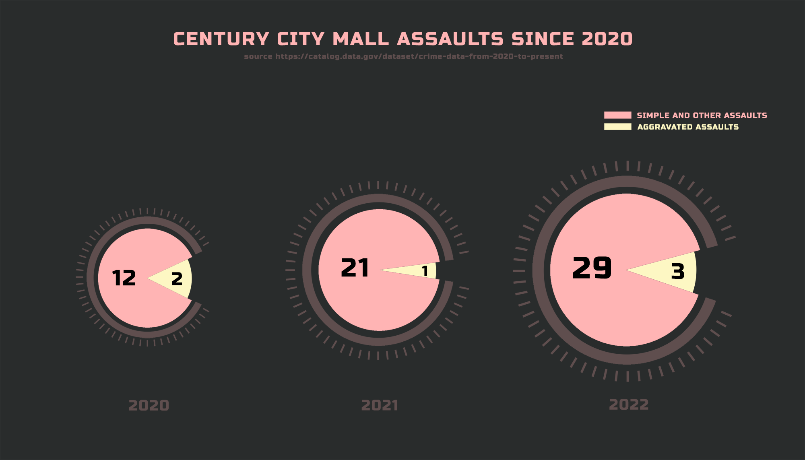
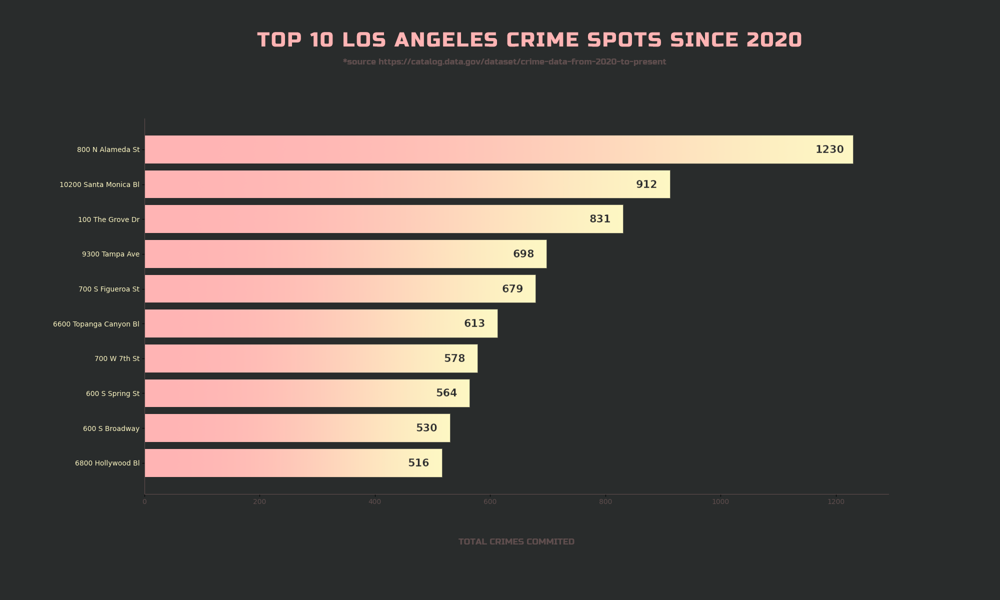

<strong>ABOUT</strong> 
 

Analyzing growth in reported crimes in Century City, California mall with avaliable data from 2020 to 2022. 

Data sheet provided from and can be accessed at https://catalog.data.gov/dataset/crime-data-from-2020-to-present

Why Century City mall? Century City was built on the former 20th Century Fox film studio lot and has been one of the calmest neighborhood in Los Angeles for years. Since renovating in 2017, the local mall had grown significantly in size and became a tourist attraction. As always, popular attractions bring positives and negatives with them. One of the negatives has been increase in crime in the area that didn't have much crime to report (except in movies like Die Hard and Leathal Weapon)

The publicly available data from 2020-2022 show that the CC mall, located at 10250 Santa Monica Blvd (the crime report uses 10200 Santa Monica Blvd for this entire block that spans from 10200-10300), is the second highest location in Los Angeles in total crimes commited for that time span. The most surprising piece of info from the report is that the CC mall has surpassed Union Station (No.1 location in total crimes commited in LA from 2020-2022) in reported crimes for 2022. 

<strong>THE GOOD AND THE BAD</strong> 
 
Obviously, the bad thing is the crime is rising rapidly and doubled from 2021 to 2022. But if I can offer some silver lining, most of the crime is tied to shoplifting and theft. There is rise in assaults and robberies, and while the numbers are not huge they are growing. The other serious crimes do happen but are just a fraction of total crimes commited.  

<strong>HOW TO NAVIGATE THIS REPO?</strong> 
 
The main data frame that holds all the crimes in LA is in la_data package. The auxilliary package called la_metro_area is there to compare CC mall with the top 10 crime locations within LA and produces one chart. 
 
The century_city package holds all data that pertains to the CC mall and crimes commited at this location. This is the biggest package of all in this project.

<strong>WHAT HAVE I COVERED?</strong> 
 
1. Top 10 LA crimes locations
2. CC mall top crimes for 2020-2022
3. CC mall rise in crime from 2020 to 2022
4. CC mall crimes per day from 2020 to 2022
5. CC mall rise in assaults from 2020 to 2022
6. How CC mall crime growth compares to the crime growth of other top 10 locations in LA

<strong>NOTES</strong> 
 
All charts are in the assets folder

<strong>SCREENSHOTS</strong>

